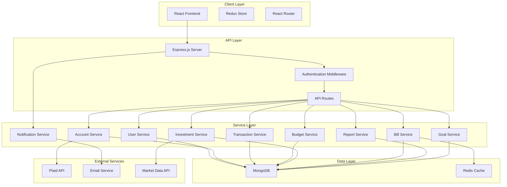

# Finance App Design Document

## Overview

The finance app will be built as a secure, scalable personal finance management platform using the MERN stack within a Turborepo monorepo structure. The application will provide comprehensive financial management capabilities including account aggregation, transaction tracking, budgeting, investment monitoring, and financial analytics.

The architecture follows a microservices-inspired approach within the monorepo, with clear separation between client, server, and shared utilities. Security is paramount given the sensitive nature of financial data, with end-to-end encryption, secure authentication, and compliance with financial data protection standards.

## Architecture

### High-Level Architecture



### Monorepo Structure

The monorepo structure is designed to support efficient development and deployment with clear separation of concerns:

```
finance-app/
├── apps/
│   ├── client/          # React frontend application
│   └── server/          # Express.js backend application
├── packages/
│   ├── shared/          # Shared types, utilities, and constants
│   ├── ui/              # Shared UI components
│   └── config/          # Shared configuration
├── turbo.json           # Turborepo configuration
├── package.json         # Root package.json
└── README.md
```

**Design Rationale**: The monorepo structure enables code sharing between client and server while maintaining clear boundaries. Turborepo provides efficient caching and parallel execution, reducing build times and improving developer experience. The shared packages ensure type safety and consistency across the application.


## Components and Interfaces

### Frontend Components

#### Core Layout Components
- **AppLayout**: Main application shell with navigation and sidebar
- **Dashboard**: Primary landing page with financial overview
- **Navigation**: Responsive navigation component with role-based menu items
- **Sidebar**: Collapsible sidebar for secondary navigation

#### Feature Components
- **AccountList**: Display and manage connected financial accounts with sync status
- **TransactionTable**: Searchable, filterable transaction list with pagination and categorization
- **BudgetCard**: Individual budget display with progress indicators and threshold alerts
- **InvestmentPortfolio**: Portfolio overview with charts, performance metrics, and asset allocation
- **BillTracker**: Upcoming bills, payment status, and overdue bill highlighting
- **ReportGenerator**: Interactive report creation with customizable date ranges and export options
- **GoalTracker**: Financial goal progress, milestone tracking, and achievement celebrations
- **NotificationCenter**: In-app notification management with read/unread status
- **SecurityDashboard**: Security settings, MFA configuration, and activity monitoring

#### Shared UI Components
- **DataTable**: Reusable table component with sorting, filtering, and pagination
- **Chart**: Wrapper for Chart.js with consistent styling
- **Modal**: Reusable modal component for forms and confirmations
- **Form**: Form components with validation and error handling
- **LoadingSpinner**: Consistent loading states across the application

### Backend Services

#### Authentication Service
```typescript
interface AuthService {
  register(userData: UserRegistrationData): Promise<User>
  login(credentials: LoginCredentials): Promise<AuthToken>
  refreshToken(token: string): Promise<AuthToken>
  resetPassword(email: string): Promise<void>
  verifyEmail(token: string): Promise<void>
}
```

#### Account Service
```typescript
interface AccountService {
  connectAccount(userId: string, credentials: BankCredentials): Promise<Account>
  syncAccounts(userId: string): Promise<Account[]>
  disconnectAccount(userId: string, accountId: string): Promise<void>
  getAccountBalance(accountId: string): Promise<Balance>
}
```

#### Transaction Service
```typescript
interface TransactionService {
  getTransactions(userId: string, filters: TransactionFilters): Promise<Transaction[]>
  categorizeTransaction(transactionId: string, category: string): Promise<Transaction>
  createManualTransaction(userId: string, transaction: TransactionData): Promise<Transaction>
  detectDuplicates(userId: string): Promise<Transaction[]>
}
```

#### Budget Service
```typescript
interface BudgetService {
  createBudget(userId: string, budget: BudgetData): Promise<Budget>
  updateBudgetProgress(userId: string, budgetId: string): Promise<Budget>
  getBudgetStatus(userId: string): Promise<BudgetStatus[]>
  generateBudgetReport(userId: string, period: DateRange): Promise<BudgetReport>
  sendBudgetNotifications(userId: string, budgetId: string): Promise<void>
  checkBudgetThresholds(userId: string): Promise<BudgetAlert[]>
}
```


## Data Models

### User Model
```typescript
interface User {
  _id: ObjectId
  email: string
  passwordHash: string
  profile: {
    firstName: string
    lastName: string
    phone?: string
    timezone: string
  }
  preferences: {
    currency: string
    dateFormat: string
    notifications: NotificationSettings
  }
  security: {
    mfaEnabled: boolean
    mfaSecret?: string
    backupCodes?: string[]
    lastLogin: Date
    loginAttempts: number
    lockedUntil?: Date
    securityQuestions?: {
      question: string
      answerHash: string
    }[]
  }
  createdAt: Date
  updatedAt: Date
}
```

### Account Model
```typescript
interface Account {
  _id: ObjectId
  userId: ObjectId
  plaidAccountId: string
  institutionName: string
  accountName: string
  accountType: 'checking' | 'savings' | 'credit' | 'investment' | 'loan'
  balance: {
    current: number
    available?: number
    limit?: number
  }
  isActive: boolean
  lastSynced: Date
  createdAt: Date
}
```

### Transaction Model
```typescript
interface Transaction {
  _id: ObjectId
  userId: ObjectId
  accountId: ObjectId
  plaidTransactionId?: string
  amount: number
  description: string
  merchantName?: string
  category: {
    primary: string
    detailed: string
  }
  date: Date
  isManual: boolean
  tags: string[]
  notes?: string
  isDuplicate: boolean
  createdAt: Date
}
```

### Budget Model
```typescript
interface Budget {
  _id: ObjectId
  userId: ObjectId
  name: string
  category: string
  limit: number
  period: 'monthly' | 'weekly' | 'yearly'
  spent: number
  startDate: Date
  endDate: Date
  isActive: boolean
  notifications: {
    at75Percent: boolean
    at90Percent: boolean
    atLimit: boolean
  }
  createdAt: Date
}
```

### Investment Model
```typescript
interface Investment {
  _id: ObjectId
  userId: ObjectId
  accountId: ObjectId
  symbol: string
  name: string
  quantity: number
  currentPrice: number
  purchasePrice: number
  purchaseDate: Date
  marketValue: number
  gainLoss: number
  gainLossPercent: number
  lastUpdated: Date
}
```


## Error Handling

### Frontend Error Handling
- **Global Error Boundary**: Catch and display React component errors gracefully
- **API Error Interceptor**: Centralized handling of HTTP errors with user-friendly messages
- **Form Validation**: Real-time validation with clear error messages
- **Network Error Handling**: Offline detection and retry mechanisms

### Backend Error Handling
- **Custom Error Classes**: Structured error types for different scenarios
- **Error Middleware**: Centralized error processing and logging
- **Validation Errors**: Comprehensive input validation with detailed error responses
- **External API Errors**: Graceful handling of third-party service failures

```typescript
class AppError extends Error {
  statusCode: number
  isOperational: boolean
  
  constructor(message: string, statusCode: number) {
    super(message)
    this.statusCode = statusCode
    this.isOperational = true
  }
}

// Error handling middleware
const errorHandler = (err: Error, req: Request, res: Response, next: NextFunction) => {
  if (err instanceof AppError) {
    return res.status(err.statusCode).json({
      status: 'error',
      message: err.message
    })
  }
  
  // Log unexpected errors
  console.error(err)
  res.status(500).json({
    status: 'error',
    message: 'Something went wrong'
  })
}
```

## Testing Strategy

### Frontend Testing
- **Unit Tests**: Jest and React Testing Library for component testing
- **Integration Tests**: Testing component interactions and data flow
- **E2E Tests**: Cypress for critical user journeys
- **Visual Regression Tests**: Chromatic for UI consistency

### Backend Testing
- **Unit Tests**: Jest for service and utility function testing
- **Integration Tests**: Supertest for API endpoint testing
- **Database Tests**: In-memory MongoDB for data layer testing
- **Security Tests**: Automated security scanning and penetration testing

### Test Coverage Goals
- Minimum 80% code coverage for critical paths
- 100% coverage for authentication and security functions
- Comprehensive testing of financial calculations and data integrity

### Testing Infrastructure
```typescript
// Example test structure
describe('TransactionService', () => {
  beforeEach(async () => {
    await setupTestDatabase()
  })
  
  afterEach(async () => {
    await cleanupTestDatabase()
  })
  
  describe('categorizeTransaction', () => {
    it('should update transaction category successfully', async () => {
      // Test implementation
    })
    
    it('should handle invalid transaction ID', async () => {
      // Error case testing
    })
  })
})
```

### Security Considerations

#### Data Protection
- **Encryption at Rest**: AES-256 encryption for sensitive data in MongoDB
- **Encryption in Transit**: TLS 1.3 for all API communications
- **API Security**: Rate limiting, CORS configuration, and input sanitization
- **Authentication**: JWT tokens with refresh token rotation and secure session management
- **Authorization**: Role-based access control with granular permissions
- **Multi-Factor Authentication**: TOTP and SMS-based MFA with backup codes
- **Password Security**: Bcrypt hashing with salt rounds and password complexity requirements

#### Session Management
- **Session Timeout**: Automatic session expiration after inactivity periods
- **Concurrent Session Control**: Limit number of active sessions per user
- **Session Invalidation**: Immediate session termination on security events
- **Device Tracking**: Monitor and alert on new device logins

#### Compliance
- **PCI DSS**: Compliance for handling financial data with secure data transmission
- **GDPR**: Data privacy, user consent management, and right to deletion
- **SOC 2**: Security controls, audit requirements, and data integrity
- **Bank-Level Security**: Following financial industry security standards and best practices

#### Monitoring and Logging
- **Security Event Logging**: Comprehensive audit trail for all financial operations and user activities
- **Anomaly Detection**: Automated detection of suspicious activities and login patterns
- **Performance Monitoring**: Application performance, uptime tracking, and resource utilization
- **Error Tracking**: Centralized error logging, alerting, and incident response
- **Data Access Logging**: Track all access to sensitive financial data with timestamps and user identification

### Development and Deployment Considerations

#### Turborepo Integration
- **Parallel Execution**: Turborepo enables parallel building and testing of packages, significantly reducing development cycle times
- **Intelligent Caching**: Build artifacts are cached based on content hashing, avoiding unnecessary rebuilds
- **Dependency Management**: Shared dependencies are managed efficiently across packages with workspace hoisting
- **Development Workflow**: Single command development setup with concurrent client and server execution

**Design Rationale**: The Turborepo integration addresses Requirement 10 by providing efficient development workflows, optimized builds, and proper dependency management across the monorepo structure.

#### Data Consistency and Integrity
- **Transaction Atomicity**: Database operations use MongoDB transactions to ensure data consistency
- **Duplicate Detection**: Advanced algorithms detect and flag duplicate transactions across accounts
- **Data Validation**: Comprehensive input validation at both API and database levels
- **Audit Trail**: Complete audit logging for all financial data modifications

**Design Rationale**: These measures ensure data integrity and provide the reliability required for financial applications, addressing the critical nature of financial data accuracy.

#### Performance Optimization
- **Database Indexing**: Strategic indexing on frequently queried fields (userId, date ranges, categories)
- **Caching Strategy**: Redis caching for frequently accessed data like account balances and recent transactions
- **Pagination**: Efficient pagination for large datasets like transaction histories
- **Lazy Loading**: Frontend components implement lazy loading for improved initial load times

**Design Rationale**: Performance optimization ensures the application remains responsive even with large amounts of financial data, providing a smooth user experience.

#### Notification and Alert System
- **Multi-Channel Delivery**: Notifications delivered via email, in-app, and potentially SMS
- **Smart Scheduling**: Intelligent scheduling prevents notification spam while ensuring important alerts are delivered
- **Preference Management**: Granular user control over notification types and delivery methods
- **Template System**: Flexible template system for consistent notification formatting

**Design Rationale**: The notification system addresses multiple requirements (4.3, 6.2, 8.3) by providing timely, relevant alerts that help users stay on top of their financial goals and obligations.

This design provides a robust foundation for building a comprehensive finance application that meets modern security standards while delivering an excellent user experience through the MERN stack and Turborepo architecture.